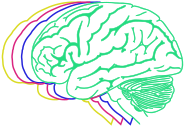

# SHAMAN

Split-Half Analysis of Motion Associated Networks

<br clear="left" />

Motion impact score detects whether residual in-scanner head motion artifact spuriously inflates or obscures resting-state fMRI trait-connectivity correlations.

## Quick Start

Clone the repository.

```sh
git clone https://github.com/DosenbachGreene/shaman.git
cd shaman
```

Start Matlab and generate simulated data.

```matlab
cd simulate
simulate % writes simulated data to sub*.mat
cd ..
```

Compute motion impact score for the simulated fMRI data and trait.

```matlab
% Construct a DataProvider object.
% Point to the folder containing the simulated data.
data_provider = SimulatedDataProvider('simulate');
% Feed the data into the SHAMAN algorithm.
% Specify names of traits to analyze in a cell array.
shaman = Shaman(data_provider, {'trait'});
```

## How it Works

The motion impact score and SHAMAN algorithm are introduced [in our preprint, which you can cite](https://www.biorxiv.org/content/10.1101/2022.12.16.520797v1) if you find this tool useful. Briefly, we assume that the functional connectivity related to a trait of interest (e.g. score on a standardized test) does not vary from second to second. This allows us to:

 1. Split each participant's data into a high-motion and low-motion half.
 2. Generate a connectivity matrix from each half of the each participant's data.

Most regression approaches for functional connectivity include between-participant head motion as a covariate. In the next step, we account for possibility that this covariate will mop up some of the residual motion artifact.

 3. Regress out between-participant differences in head motion.
 4. Subtract each participant's high-motion matrix from her low-motion matrix.

At this step, it is important to recognize that the each participant's difference matrix should be zero (or unstructured noise). Absent motion artifact, _trait-related functional connectivity in the high- and low-motion matrices should be identical_ and should therefore cancel out during subtraction. Whatever is left must be due to motion.

 5. Regress the trait of interest against the difference matrices to obtain motion impact score.


## Correspondence

Please direct requestes for help or other correspondence to benjamin dot kay at wustl dot edu.